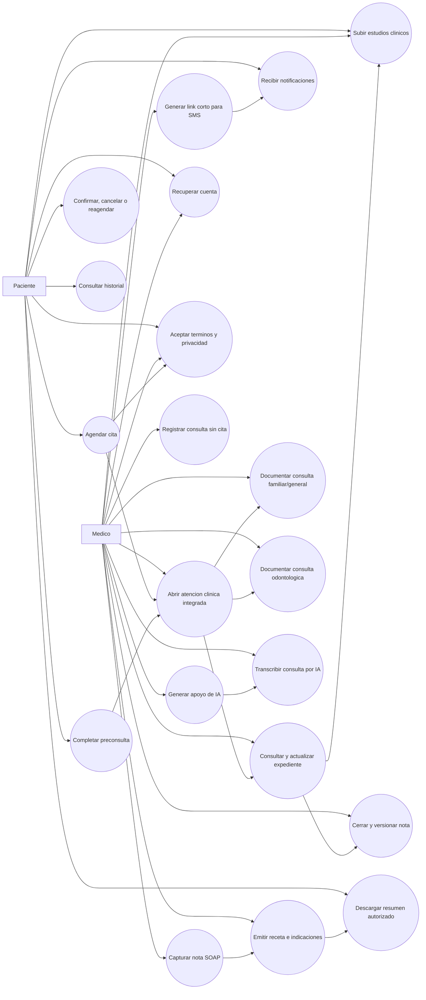

# 06 - Casos de uso y DCU

## Actores

| Actor | Descripcion |
|---|---|
| Medico | Usuario responsable de configurar la atencion, revisar pacientes, atender consultas, actualizar expediente y emitir indicaciones. |
| Paciente | Usuario que agenda, confirma, completa datos previos y consulta informacion disponible de su atencion. |

## Diagrama de casos de uso

## Caso de uso 1 - Agendar cita con expediente integrado

| Campo | Descripcion |
|---|---|
| ID | CU01 |
| Nombre | Agendar cita con expediente integrado |
| Actor principal | Paciente |
| Actor secundario | Medico |
| Objetivo | Permitir que el paciente reserve una cita y que la informacion quede lista para alimentar el paquete clinico integrado. |
| Precondiciones | El medico tiene perfil publico, servicios y disponibilidad configurados. |
| Postcondiciones | La cita queda registrada, el paciente queda creado o vinculado y se genera acceso a preconsulta. |

### Flujo principal

1. El paciente abre el perfil publico o modulo de agendado.
2. El sistema muestra medicos, servicios, fechas y horarios disponibles.
3. El paciente selecciona tipo de consulta, fecha y horario.
4. El paciente captura sus datos personales y de contacto.
5. El sistema aparta temporalmente el horario mientras el paciente completa el registro.
6. El sistema valida disponibilidad y evita traslapes.
7. El sistema crea la cita y crea o vincula el expediente del paciente.
8. El sistema registra aceptacion legal cuando aplique.
9. El sistema genera confirmacion y acceso a preconsulta.
10. El sistema envia notificacion o recordatorio configurado.

### Flujos alternos

| Alterno | Descripcion |
|---|---|
| A1 - Horario no disponible | El sistema informa que el horario ya no esta disponible y solicita elegir otro. |
| A2 - Paciente con cuenta | El sistema prellena datos y vincula la cita al historial del paciente. |
| A3 - Paciente invitado | El sistema permite agendar con datos minimos y conserva opcion de vinculacion posterior. |
| A4 - Hold expirado | El sistema libera el horario y solicita confirmar disponibilidad antes de continuar. |

## Caso de uso 2 - Completar preconsulta y consultar historial

| Campo | Descripcion |
|---|---|
| ID | CU02 |
| Nombre | Completar preconsulta y consultar historial |
| Actor principal | Paciente |
| Actor secundario | Medico |
| Objetivo | Recopilar informacion clinica previa y permitir continuidad de atencion para el paciente. |
| Precondiciones | Existe una cita activa o una cuenta de paciente vinculada. |
| Postcondiciones | Las respuestas quedan asociadas a la atencion clinica y disponibles para el medico. |

### Flujo principal

1. El paciente ingresa al portal o al enlace de preconsulta.
2. El sistema valida sesion o token.
3. El paciente responde antecedentes, sintomas, motivo de consulta y datos relevantes.
4. El paciente adjunta documentos o estudios clinicos si aplica y tiene permisos de carga.
5. El sistema guarda respuestas y actualiza el contexto de atencion.
6. El paciente consulta sus citas, historial disponible y documentos autorizados.

### Flujos alternos

| Alterno | Descripcion |
|---|---|
| A1 - Token invalido | El sistema muestra error recuperable y sugiere contactar al consultorio. |
| A2 - Datos incompletos | El sistema permite guardar avance o solicita campos obligatorios segun el formulario. |
| A3 - Sin historial | El sistema muestra estado vacio y ofrece agendar una nueva cita. |
| A4 - Enlace de carga expirado | El sistema rechaza la carga y solicita al paciente pedir un nuevo enlace al consultorio. |

## Caso de uso 3 - Atender consulta desde paquete integrado

| Campo | Descripcion |
|---|---|
| ID | CU03 |
| Nombre | Atender consulta desde paquete integrado |
| Actor principal | Medico |
| Actor secundario | Paciente |
| Objetivo | Permitir que el medico atienda una consulta con agenda, expediente, preconsulta, nota, receta e indicaciones en una sola experiencia. |
| Precondiciones | El medico inicio sesion y existe una cita programada o paciente seleccionado. |
| Postcondiciones | La atencion queda registrada, el expediente actualizado y las indicaciones disponibles para el paciente segun permisos. |

### Flujo principal

1. El medico abre la atencion desde la agenda o desde el paciente.
2. El sistema muestra la cita, datos del paciente, historial, preconsulta y alertas.
3. El medico revisa o actualiza antecedentes y contexto clinico.
4. El medico revisa estudios clinicos cargados por el paciente o sube nuevos documentos.
5. El medico captura la nota SOAP manualmente o con apoyo de IA.
6. El medico revisa sugerencias, alertas y validaciones antes de guardar.
7. El medico emite receta e indicaciones.
8. El medico cierra y firma la nota clinica cuando la atencion termina.
9. El sistema registra version, auditoria y actualiza historial del paciente.
10. El sistema deja disponible la informacion autorizada para el paciente.

### Flujos alternos

| Alterno | Descripcion |
|---|---|
| A1 - Fallo de IA | El sistema permite continuar captura manual sin bloquear la consulta. |
| A2 - Expediente no vinculado | El medico puede crear o vincular expediente desde la atencion. |
| A3 - Falta informacion previa | El sistema muestra campos pendientes y permite completar durante consulta. |
| A4 - Falta estudio solicitado | El medico puede generar un enlace temporal y enviarlo por SMS usando link corto. |
| A5 - Paciente sin cita | El medico puede abrir una consulta sin cita previa y vincularla al expediente. |

## Caso de uso 4 - Subir estudios clinicos mediante medico o enlace temporal

| Campo | Descripcion |
|---|---|
| ID | CU04 |
| Nombre | Subir estudios clinicos mediante medico o enlace temporal |
| Actor principal | Medico |
| Actor secundario | Paciente |
| Objetivo | Permitir que estudios de laboratorio, imagenes u otros documentos clinicos queden asociados a la cita o expediente correspondiente. |
| Precondiciones | Existe una cita o expediente activo y el medico tiene permisos sobre el paciente. |
| Postcondiciones | El documento queda guardado, clasificado, disponible para revision clinica y registrado en auditoria. |

### Flujo principal

1. El medico abre la atencion clinica integrada.
2. El medico selecciona subir documento o habilitar carga para paciente.
3. Si sube el archivo directamente, el sistema solicita archivo, categoria y descripcion opcional.
4. Si habilita carga externa, el sistema genera un enlace temporal asociado a la cita.
5. El paciente abre el enlace, selecciona archivo y confirma la carga.
6. El sistema valida vigencia, permisos, archivo y asociacion clinica.
7. El sistema guarda el documento y lo muestra en el expediente y contexto de la cita.
8. El sistema registra auditoria de la carga.

### Flujos alternos

| Alterno | Descripcion |
|---|---|
| A1 - Archivo invalido | El sistema rechaza el archivo e informa el motivo. |
| A2 - Enlace expirado | El sistema no permite cargar y solicita generar un nuevo enlace. |
| A3 - Carga deshabilitada | El sistema impide la carga externa hasta que el medico la habilite. |
| A4 - Documento sensible | El sistema conserva permisos y trazabilidad antes de mostrarlo al paciente. |

## Caso de uso 5 - Documentar consulta familiar/general

| Campo | Descripcion |
|---|---|
| ID | CU05 |
| Nombre | Documentar consulta familiar/general |
| Actor principal | Medico |
| Actor secundario | Paciente |
| Objetivo | Registrar una consulta de medicina familiar/general con enfoque preventivo, antecedentes, factores de riesgo y plan clinico. |
| Precondiciones | El medico tiene especialidad V2 configurada como medicina familiar/general y existe una atencion abierta. |
| Postcondiciones | La historia, nota, receta, indicaciones y plan preventivo quedan asociados al paciente. |

### Flujo principal

1. El medico abre la atencion clinica integrada.
2. El sistema carga plantilla de medicina familiar/general.
3. El medico revisa antecedentes, factores de riesgo y revision por sistemas.
4. El medico documenta exploracion fisica y hallazgos relevantes.
5. El medico solicita o registra laboratorios, gabinete o tamizajes preventivos.
6. El medico puede solicitar apoyo de IA para resumen longitudinal, brechas clinicas o instrucciones.
7. El medico captura SOAP, receta, indicaciones y seguimiento.
8. El sistema guarda version, auditoria y disponibilidad para historial del paciente.

### Flujos alternos

| Alterno | Descripcion |
|---|---|
| A1 - Consulta sin IA | El medico completa la consulta manualmente. |
| A2 - Faltan antecedentes | El sistema marca brechas clinicas y permite completarlas durante la consulta. |
| A3 - Requiere estudios | El medico solicita estudios y puede generar enlace temporal para carga posterior. |

## Caso de uso 6 - Documentar consulta odontologica

| Campo | Descripcion |
|---|---|
| ID | CU06 |
| Nombre | Documentar consulta odontologica |
| Actor principal | Medico |
| Actor secundario | Paciente |
| Objetivo | Registrar evaluacion dental con odontograma, periodontograma, condiciones bucales y plan de tratamiento. |
| Precondiciones | El medico tiene especialidad V2 configurada como odontologia y existe una atencion abierta. |
| Postcondiciones | Los hallazgos dentales, plan de tratamiento y seguimiento quedan asociados al expediente del paciente. |

### Flujo principal

1. El dentista abre la atencion clinica integrada.
2. El sistema carga el modulo odontologico.
3. El dentista registra hallazgos por pieza y superficie en el odontograma.
4. El dentista registra datos periodontales cuando aplique.
5. El dentista documenta condiciones bucales generales como bruxismo, maloclusion o enfermedad periodontal.
6. El dentista define plan de tratamiento por pieza o general, prioridad, estado y fecha sugerida.
7. El dentista cierra y firma la nota cuando el registro queda revisado.
8. El sistema guarda el payload odontologico junto con SOAP, receta, indicaciones y proxima revision.

### Flujos alternos

| Alterno | Descripcion |
|---|---|
| A1 - Tratamiento general | El dentista registra el plan con pieza `GENERAL`. |
| A2 - Estudio odontologico requerido | El dentista solicita radiografia, imagen o estudio y genera enlace temporal. |
| A3 - Consulta preventiva | El sistema permite registrar higiene, profilaxis, fluor y proxima revision sin procedimiento invasivo. |

## Caso de uso 7 - Recuperar cuenta por correo

| Campo | Descripcion |
|---|---|
| ID | CU07 |
| Nombre | Recuperar cuenta por correo |
| Actor principal | Medico o Paciente |
| Actor secundario | Sistema |
| Objetivo | Permitir que un usuario recupere acceso cuando olvida su contrasena sin comprometer seguridad. |
| Precondiciones | El usuario tiene un correo registrado o intenta recuperar una cuenta por correo. |
| Postcondiciones | Si el correo pertenece a una cuenta activa, se envia un enlace temporal de restablecimiento; el sistema no revela si la cuenta existe. |

### Flujo principal

1. El usuario selecciona "Olvide mi contrasena".
2. El sistema solicita correo electronico.
3. El usuario captura su correo.
4. El sistema responde con mensaje generico para evitar enumeracion de cuentas.
5. Si existe una cuenta activa, el sistema genera token de un solo uso con expiracion corta.
6. El sistema envia correo con enlace seguro de restablecimiento.
7. El usuario abre el enlace y captura una nueva contrasena.
8. El sistema valida token, politica de contrasena y expiracion.
9. El sistema actualiza la contrasena, invalida el token y registra auditoria.

### Flujos alternos

| Alterno | Descripcion |
|---|---|
| A1 - Token expirado | El sistema rechaza el cambio y permite solicitar un nuevo enlace. |
| A2 - Token usado | El sistema rechaza la reutilizacion y registra el intento. |
| A3 - Demasiadas solicitudes | El sistema aplica rate limit por correo/IP. |
| A4 - Contrasena debil | El sistema solicita una contrasena que cumpla la politica vigente. |

## Caso de uso 8 - Descargar resumen autorizado

| Campo | Descripcion |
|---|---|
| ID | CU08 |
| Nombre | Descargar resumen autorizado |
| Actor principal | Paciente |
| Actor secundario | Medico |
| Objetivo | Permitir que el paciente consulte o descargue la informacion autorizada de su atencion sin exponer todo el expediente. |
| Precondiciones | Existe una cita o encuentro clinico cerrado y el medico autorizo contenido compartible. |
| Postcondiciones | El paciente obtiene el resumen y el sistema registra acceso o descarga. |

### Flujo principal

1. El paciente ingresa al portal o a un enlace autorizado.
2. El sistema valida sesion, token o permiso.
3. El sistema muestra el resumen disponible: indicaciones, receta, documentos permitidos y seguimiento.
4. El paciente descarga o consulta el resumen.
5. El sistema registra auditoria de acceso.

### Flujos alternos

| Alterno | Descripcion |
|---|---|
| A1 - Resumen no autorizado | El sistema informa que el documento aun no esta disponible. |
| A2 - Token invalido o expirado | El sistema rechaza el acceso y ofrece iniciar sesion si aplica. |

## Caso de uso 9 - Transcribir consulta por IA

| Campo | Descripcion |
|---|---|
| ID | CU09 |
| Nombre | Transcribir consulta por IA |
| Actor principal | Medico |
| Actor secundario | Paciente |
| Objetivo | Convertir audio o voz de la consulta en texto clinico revisable para apoyar la captura de nota sin reemplazar el criterio medico. |
| Precondiciones | Existe una atencion clinica abierta, el medico tiene permisos y se cuenta con consentimiento del paciente para uso de audio/IA. |
| Postcondiciones | La transcripcion queda disponible como borrador revisable; el sistema registra consentimiento, uso, version, proveedor y auditoria. |

### Flujo principal

1. El medico abre la atencion clinica integrada.
2. El sistema solicita o verifica consentimiento para grabacion/transcripcion y uso de IA.
3. El medico inicia captura de audio o carga un audio permitido.
4. El sistema envia el audio al proveedor de transcripcion configurado.
5. El sistema recibe texto transcrito y lo muestra como borrador.
6. El medico revisa, corrige y decide si usa el texto para nota SOAP, resumen o instrucciones.
7. El sistema registra auditoria, proveedor, fecha, responsable, version y resultado aprobado o descartado.

### Flujos alternos

| Alterno | Descripcion |
|---|---|
| A1 - Sin consentimiento | El sistema no permite iniciar transcripcion y mantiene captura manual. |
| A2 - Fallo del proveedor IA | El sistema informa el fallo y permite continuar sin IA. |
| A3 - Transcripcion imprecisa | El medico corrige o descarta el texto antes de integrarlo a la nota. |
| A4 - Audio sensible | El sistema aplica politica de retencion o descarte del audio segun configuracion aprobada. |

## Relacion entre casos de uso y requisitos

| Caso de uso | Requisitos cubiertos |
|---|---|
| CU01 | RF03, RF04, RF05, RF06, RF07, RF08, RF16, RF34, RF35 |
| CU02 | RF06, RF08, RF15, RF18, RF19, RF20 |
| CU03 | RF09, RF10, RF11, RF12, RF13, RF14, RF17, RF18, RF19, RF20, RF21, RF36, RF38 |
| CU04 | RF09, RF10, RF19, RF20, RF21, RF18 |
| CU05 | RF09, RF10, RF11, RF12, RF14, RF18, RF22, RF23, RF36, RF39 |
| CU06 | RF09, RF10, RF11, RF12, RF14, RF18, RF22, RF24, RF36 |
| CU07 | RF02, RF18, RF32, RF33 |
| CU08 | RF15, RF18, RF37 |
| CU09 | RF13, RF18, RF29, RF40 |
